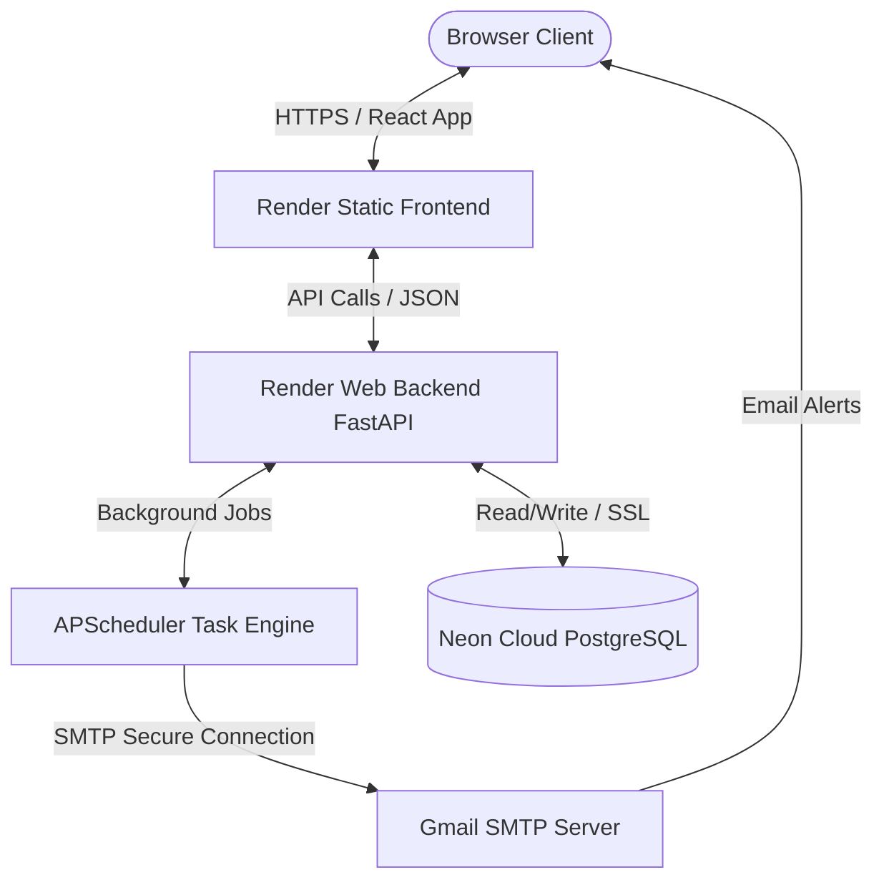

#  GoalSync

GoalSync is a modern, enterprise-ready Performance Management & OKR tracking system. Designed to align team goals, automate review workflows, and provide powerful organization-wide analytics, GoalSync empowers employees, managers, and administrators to streamline performance reviews seamlessly.

---

##  Demo / Sandbox Accounts

To explore GoalSync across different roles immediately, you can log in using these pre-seeded sandbox accounts. **All accounts share the same password:** `Demo@1234`

| Role | Name | Email Address | Password | Key Capabilities |
| :--- | :--- | :--- | :--- | :--- |
| **Admin** | Admin User | `admin@goalsync.demo` | `Demo@1234` | Open/pause/close cycles, manage users & roles, assign managers, view audit logs, push shared organization goal templates. |
| **Manager** | Sarah Manager | `manager@goalsync.demo` | `Demo@1234` | Side-by-side goal reviews, submit check-in ratings/feedback, view direct reports' completion analytics and team tracker. |
| **Employee** | John Employee | `employee@goalsync.demo` | `Demo@1234` | Draft & submit goal sheets (100% weight check), perform self-evaluation quarterly check-ins. (Reports to **Sarah**) |
| **Employee** | Alice Employee | `alice@goalsync.demo` | `Demo@1234` | Draft & submit goal sheets (100% weight check), perform self-evaluation quarterly check-ins. (Reports to **Sarah**) |

---

##  Key Features

### Employee Portal
*   **Interactive Goal Sheet Builder:** Create structured quarterly or annual goals with custom weightages (ensuring a total of 100%).
*   **Draft & Submission Workflows:** Work on your goal sheets in draft mode and submit them for manager approval once ready.
*   **Quarterly Check-ins:** Self-evaluate goals by updating target values, adding notes, and tracking individual completion scores.

###  Manager Review & Team Dashboard
*   **Centralized Approvals:** View team goal sheets side-by-side with previous versions, approve with comments, or return them with change requests.
*   **Check-in Evaluations:** Review employee check-ins and add official manager feedback and performance ratings.
*   **Team Progress Analytics:** Monitor overall team goal completion rates, weightage distributions, and individual status trackers at a glance.

### Admin Control Center & Compliance
*   **Cycle Manager:** Open, pause, and close goal creation and review cycles with strict organizational deadlines.
*   **User & Hierarchy Management:** Manage users, assign direct managers, and control roles (Employee, Manager, Admin).
*   **Audit Logging:** Access a secure, chronological ledger of all critical actions (submissions, approvals, returns, role changes).
*   **Shared Templates:** Push template goals down to all active employee goal sheets for organizational alignment.

###  Analytics & Automated Workflows
*   **Organization-Wide Analytics:** Visual distributions of goal statuses, completion rates, cycle timelines, and alignment vectors.
*   **Automated Email Notifications:** Beautiful HTML emails triggered for:
    *   Goal sheet submission, approval, or return.
    *   Review cycle announcements.
    *   Approaching deadlines and check-in reminders.
*   **Escalation Engine:** Automatically escalates unreviewed employee sheets to higher management if a manager fails to review within designated thresholds.

---

##  Technology Stack

| Component | Technology | Description |
| :--- | :--- | :--- |
| **Backend** | Python / FastAPI | Asynchronous high-performance REST API |
| **Database** | PostgreSQL | Robust relational database storing organizational hierarchies and logs |
| **Migration** | Alembic | Sequential database schema migrations |
| **Background Tasks** | APScheduler | Automated reminder emails and manager escalations |
| **Frontend** | React / Vite | Ultra-fast single-page web app |
| **Styling** | Tailwind CSS | Sleek, cohesive, and modern glassmorphism design |
| **Testing** | Pytest / Vitest | Comprehensive backend unit testing & frontend component testing |
| **Deployment** | Docker & Render | Ready-to-go Docker Compose & Render native multi-service manifests |

---

##  Getting Started

###  Option 1: Running with Docker Compose (Recommended)

To run the entire ecosystem (Frontend, Backend, and PostgreSQL database) with a single command:

1. Clone the repository and navigate to the directory:
   ```bash
   cd GoalSync
   ```
2. Build and start the services:
   ```bash
   docker-compose up --build
   ```
3. Access the applications:
   *   **Frontend Web App:** `http://localhost:5173`
   *   **FastAPI API Docs (Swagger):** `http://localhost:8000/docs`

---

###  Option 2: Local Development Setup

#### 1. Backend Setup
1. Navigate to the backend folder:
   ```bash
   cd backend
   ```
2. Create and activate a Python virtual environment:
   ```bash
   python -m venv venv
   # On Windows (PowerShell)
   .\venv\Scripts\Activate.ps1
   # On macOS/Linux
   source venv/bin/activate
   ```
3. Install dependencies:
   ```bash
   pip install -r requirements.txt
   ```
4. Copy the environment template and set your variables:
   ```bash
   cp .env.example .env  # configure database credentials and mail server details
   ```
5. Run database migrations:
   ```bash
   alembic upgrade head
   ```
6. (Optional) Seed the database with demo users (Employee, Manager, Admin):
   ```bash
   python seed.py
   ```
7. Start the API server:
   ```bash
   uvicorn app.main:app --reload --port 8000
   ```

#### 2. Frontend Setup
1. Navigate to the frontend folder:
   ```bash
   cd ../frontend
   ```
2. Install npm packages:
   ```bash
   npm install
   ```
3. Start the Vite dev server:
   ```bash
   npm run dev
   ```

---

##  Testing

Both frontend and backend are equipped with automated test suites:

*   **Backend Tests (FastAPI / Pytest):**
    ```bash
    cd backend
    pytest
    ```
*   **Frontend Tests (React / Vitest):**
    ```bash
    cd frontend
    npm run test
    ```

---

## 🏛️ Architecture & Hosting Choices

### System Architecture Diagram
The architecture is designed to be lightweight, secure, and highly scalable, using an asynchronous FastAPI backend communicating with a React single-page frontend.



### Hosting & Infrastructure Choices

1. **Frontend Hosting (Render Static Sites):**
   * **Why:** Fast, globally distributed CDN for hosting the built React-Vite static bundle. Native support for SSL, custom URL rewrites, and 100% free with no credit card requirement.
2. **Backend Web Service (Render Python):**
   * **Why:** Native support for ASGI/Python web servers (FastAPI + Gunicorn), easy management of background threads (APScheduler) in the same process pool, automatic deployment on git push, and SSL termination.
3. **Database Hosting (Neon PostgreSQL):**
   * **Why:** Serverless cloud PostgreSQL that provides auto-scaling, 100% Postgres compatibility, high availability, and a generous free tier with absolutely no credit card required.

---

##  Production Deployment

This project includes a native `render.yaml` orchestration configuration to deploy both the frontend, backend, and managed PostgreSQL databases instantly on Render. 

1. Push your code to your private GitHub repository.
2. Link your repository in Render.
3. Render will auto-detect `render.yaml` and configure the database, build commands, and environmental variables seamlessly.
